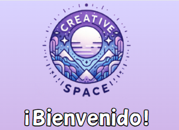
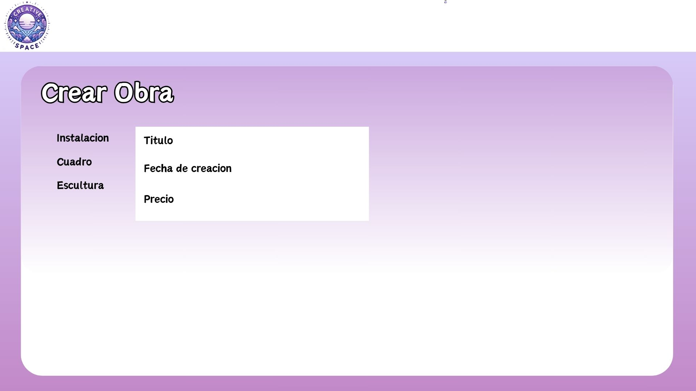
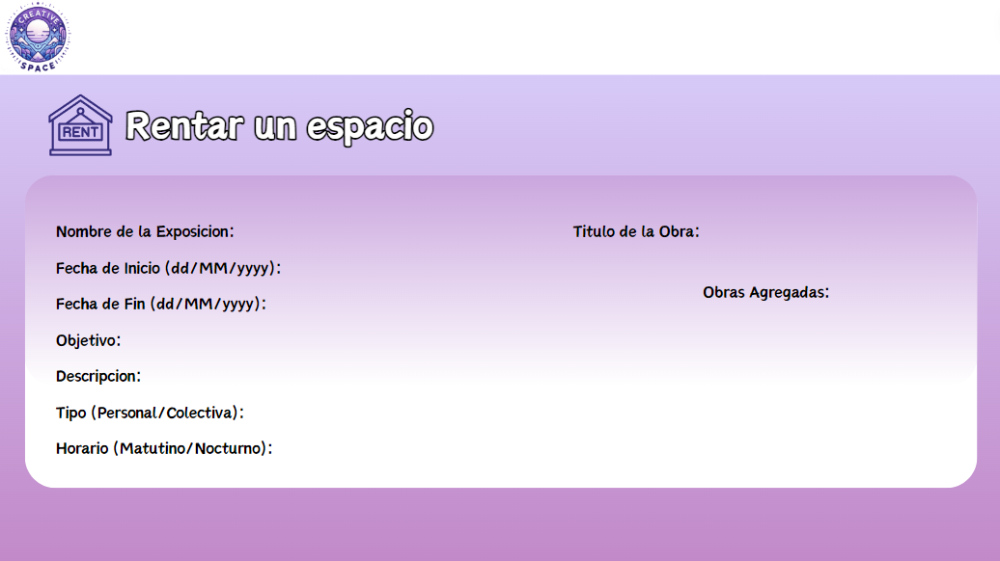
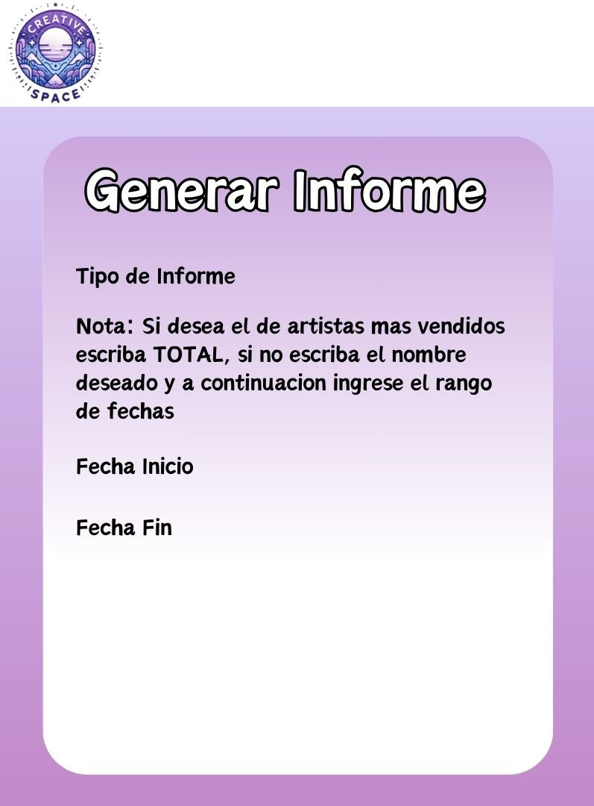
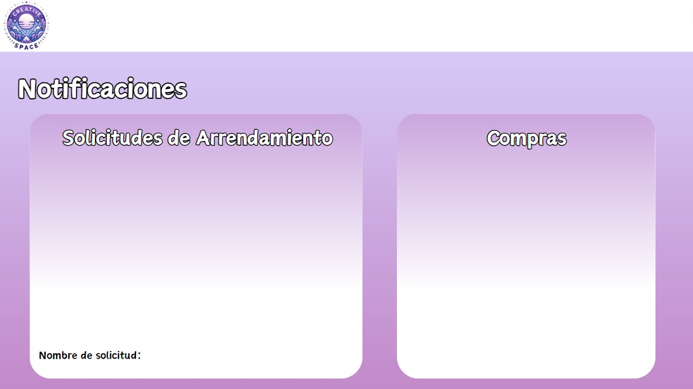

# CreativeSpace

A desktop application for managing an art gallery, built as part of the **Software Analysis & Design** course at Pontificia Universidad Javeriana, Bogota. The system allows gallery owners to manage artworks, artists, exhibitions, and sales, while customers can browse the collection, make purchases, and request space rentals.

## Table of Contents

- [Project Purpose](#project-purpose)
- [Architecture](#architecture)
- [Features](#features)
- [Tech Stack](#tech-stack)
- [Project Structure](#project-structure)
- [Setup and Installation](#setup-and-installation)
- [Screenshots](#screenshots)
- [Development Team](#development-team)
- [License](#license)

---

## Project Purpose

The application models the operations of an art gallery (**Espacio Creativo**) through the following domain entities:

- **Artista (Artist)** — name, biography, birth date, and references to their artworks and exhibitions.
- **Obra (Artwork)** — abstract entity with subtypes: `Cuadro` (Painting), `Escultura` (Sculpture), and `Instalacion` (Installation). Each has attributes for price, creation date, dimensions, materials, and media (images/videos).
- **Exposicion (Exhibition)** — name, type, date range, schedule, description, and a list of associated artworks (minimum 10).
- **Comprador (Customer)** — registered buyers with name, email, phone, and address for purchase tracking.
- **Noticia (News)** — cultural news entries with title, date, description, and optional associated artworks.
- **EspacioReserva (Space Rental)** — requests from external artists/companies to rent gallery space for exhibitions.
- **Compra (Purchase)** — transaction records linking a customer to a purchased artwork with delivery details.

Data is persisted through delimited text files (`ListaObras.txt`, `ListaArtistas.txt`, `compras.txt`, etc.) loaded at runtime.

---

## Architecture

The system follows the **Model-View-Controller (MVC)** design pattern:

```
View (Swing JFrame) --> Controller --> Model --> Text File Persistence
```

| Layer | Package | Responsibility |
|---|---|---|
| **View** | `view/` | 21 Java Swing screens (JFrame/JPanel) built with the NetBeans GUI designer. Handles all user interaction and display. |
| **Controller** | `controlador/` | 3 controller classes that process user actions, coordinate model operations, and update views. |
| **Model** | `model/` | 18 entity classes and 3 service classes handling business logic, file I/O, and data management. |

---

## Features

### Gallery Owner

- **Artwork Management** — Create, read, update, and delete artworks with type-specific attributes (paintings, sculptures, installations).
- **Artist Management** — Maintain artist profiles with biographies and track their associated works and exhibitions.
- **Exhibition Management** — Organize exhibitions with date ranges, schedules, descriptions, and curated artwork selections.
- **News Management** — Publish cultural news with titles, descriptions, and links to related artworks.
- **Space Rental Review** — Receive, review, approve, or deny rental requests from external parties.
- **Sales Reports** — Generate reports on sales by artist, by period, and overall summaries.
- **Purchase Notifications** — View incoming purchase requests from customers.

### Customer

- **Browse & Search** — Explore the gallery's artworks, artists, and exhibitions.
- **Purchase Artworks** — Register as a buyer and purchase artworks with delivery or pickup options.
- **Space Rental Requests** — Submit requests to rent gallery space for personal exhibitions.

---

## Tech Stack

| Technology | Version | Purpose |
|---|---|---|
| Java | 19 | Primary language |
| Java Swing | (bundled) | Desktop GUI framework |
| Apache Ant | (bundled) | Build automation |
| Apache NetBeans | 16+ | IDE and GUI designer (.form files) |
| Text Files | — | Data persistence (CSV/delimited format) |

---

## Project Structure

```
CreativeSpace/
├── docs/
│   └── screenshots/              # Application screenshots
├── Proyect/CreativeSpace/CreativeSpace/
│   ├── build.xml                  # Ant build configuration
│   ├── manifest.mf                # JAR manifest
│   ├── *.txt                      # Data persistence files (8 files)
│   ├── nbproject/                 # NetBeans project configuration
│   └── src/
│       ├── controlador/           # Controllers (3 classes)
│       │   ├── ControlEventosPrincipal.java
│       │   ├── ControlEventosUsuario.java
│       │   └── controlEventosReserva.java
│       ├── model/                 # Models and services (21 classes)
│       │   ├── artista.java, obra.java, cuadro.java, escultura.java, ...
│       │   ├── exposicion.java, noticia.java, compra.java, ...
│       │   └── controlObrasArtistasExposicion.java, controlRegistro.java, ...
│       ├── view/                  # Swing UI screens (21 classes + 20 .form files)
│       │   ├── SPLASH.java        # Application entry point (splash screen)
│       │   ├── PantallaLogin.java, PantallaRegistro.java
│       │   ├── PantallaPrincipal.java (main dashboard)
│       │   ├── PantallaCrearObra.java, PantallaCrearArtistas.java, ...
│       │   └── SeccionCRUDArte.java, SeccionNoticia.java, ...
│       └── espaciocreativo/
│           └── img/               # UI assets (icons, backgrounds, buttons)
└── README.md
```

---

## Setup and Installation

### Prerequisites

- **Java Development Kit (JDK) 19** or higher
- **Apache NetBeans 16+** (recommended) or any IDE with Ant support

### Steps

1. Clone the repository:
   ```bash
   git clone https://github.com/MapaRuiz/CreativeSpace.git
   cd CreativeSpace
   ```

2. Open in NetBeans:
   - Launch Apache NetBeans.
   - Go to `File > Open Project...`.
   - Navigate to `Proyect/CreativeSpace/CreativeSpace/` and open the project.

3. Build and run:
   - Right-click the project in the **Projects** pane.
   - Select **Clean and Build**.
   - Once the build succeeds, right-click again and select **Run**.

4. The application will launch with a splash screen, followed by the login screen.

> **Note:** The application uses relative file paths for data persistence. Ensure the working directory is set to the project root (`Proyect/CreativeSpace/CreativeSpace/`) when running outside of NetBeans.

---

## Screenshots

<table>
  <tr>
    <td align="center" width="50%">
      
      <br>
      <sub><b>1. Login</b><br>Welcome screen with user authentication.</sub>
    </td>
  </tr>
  <tr>
    <td align="center" width="50%">
      
      <br>
      <sub><b>2. Create Artwork</b><br>Form for adding new artworks with type selection (Painting, Sculpture, Installation).</sub>
    </td>
    <td align="center" width="50%">
      
      <br>
      <sub><b>3. Space Rental</b><br>Reservation form for renting gallery exhibition spaces.</sub>
    </td>
  </tr>
  <tr>
    <td align="center" width="50%">
      
      <br>
      <sub><b>4. Sales Reports</b><br>Report generation with filters by type, date range, and artist.</sub>
    </td>
    <td align="center" width="50%">
      
      <br>
      <sub><b>5. Notifications</b><br>Rental requests and purchase notifications panel.</sub>
    </td>
  </tr>
</table>

---

## Development Team

| Member | GitHub | Role |
|:---:|:---:|:---:|
| Maria Paula Rodriguez Ruiz | [@MapaRuiz](https://github.com/MapaRuiz) | Development |
| Juan Enrique Rozo Tarache | [@JuanR771](https://github.com/JuanR771) | Development |
| Daniel Felipe Castro Moreno | [@Dani2044](https://github.com/Dani2044) | Development |
| Gabriel Anibal Riano | [@gabrielrb23](https://github.com/gabrielrb23) | Development |

**Course:** Software Analysis & Design — Pontificia Universidad Javeriana, Bogota

---

## License

This project is licensed under the [MIT License](LICENSE).
